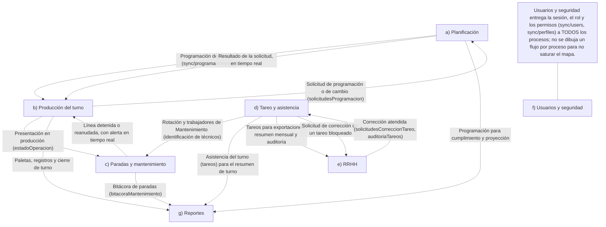

# Procesos de GLACIAL (BPMN 2.0)

Documentación de los procesos del sistema. **Solo documenta: no cambia ningún archivo de la app.**

- Los diagramas `.bpmn` están en [`docs/bpmn/`](bpmn/) y abren directamente en [bpmn.io](https://demo.bpmn.io/) y en Camunda Modeler.
- Cada diagrama se repite aquí en Mermaid para verlo en GitHub.
- Cada tarea tiene su archivo y función en la tabla de fidelidad. Lo que no se pudo confirmar en el código está marcado **por confirmar**.

## Convenciones

| Símbolo en Mermaid | Significa |
|---|---|
| 👤 | Tarea que hace una persona |
| 🛠 | Tarea manual (trabajo físico, sin pantalla) |
| ⚙ | Tarea automática del sistema |
| ((círculo)) | Evento de inicio o intermedio; ((( ))) fin |
| ✉ / ✉➤ | Evento de mensaje: recibe / envía (aviso en tiempo real) |
| ⏱ | Evento de tiempo |
| { } | Compuerta (decisión) |
| [( )] | Documento o colección de Firestore |
| línea punteada | Flujo de mensaje entre procesos o lectura/escritura de datos |

> **Nota de modelado.** En BPMN los flujos de mensaje solo pueden cruzar entre *pools* distintos. Por eso «Sistema GLACIAL» (lo automático) es un pool propio y no un carril dentro del de las personas: así los avisos en tiempo real se dibujan como flujos de mensaje, como se pidió. Los carriles por rol van dentro de cada pool de personas.

## 1. Mapa general

Archivo: [`bpmn/00-mapa-general.bpmn`](bpmn/00-mapa-general.bpmn)



| Proceso | Archivos principales | Roles |
|---|---|---|
| a) Planificación | js/produccion/51–54-planificacion-*.js · 16-paletas.js (guardarProgramacionPaleta) | Planificación, Jefe de Producción, Administrador; Supervisor de Producción (solo lectura y solicitudes) |
| b) Producción del turno | js/produccion/06-registro.js · 16-paletas.js · 24-semaforo-produccion-actual.js · 29-avance-produccion.js | Supervisor de Producción |
| c) Paradas y mantenimiento | js/mantenimiento/37b-mantenimiento-identificacion.js · 24-semaforo… · 25-alertas-lineas.js · 43-bitacora-mantenimiento.js · 46-proyeccion-avisos.js | Técnico y Supervisor de Mantenimiento, Supervisor de Producción, Jefatura |
| g) Reportes | js/produccion/09-resumen.js · 49-resumen-indicadores.js · 50-impacto-economico.js · 47-analisis-paradas.js · 48-resumen-turno.js | Jefatura, Administrador (según permiso) |
| d) Tareo y asistencia | js/personal/13-tareo.js · 20-tareo-control.js · 41-tareo-bloqueo.js · js/mantenimiento/30, 33 (rotaciones) | Supervisores, Supervisor de Mantenimiento |
| e) RRHH | js/rrhh/19, 26, 27, 38 · js/personal/40-tareo-auditoria.js | RRHH, Administrador |
| f) Usuarios y seguridad | js/accesos/03-auth.js · 10-usuarios.js · 36-seguridad-auth.js | Administrador |

**Flujos entre procesos** (qué pasa de uno a otro y por qué documento de Firestore):

| De | A | Qué viaja |
|---|---|---|
| a) Planificación | b) Producción del turno | Programación del turno (sync/programaciones) |
| b) Producción del turno | a) Planificación | Solicitud de programación o de cambio (solicitudesProgramacion) |
| a) Planificación | b) Producción del turno | Resultado de la solicitud, en tiempo real |
| b) Producción del turno | c) Paradas y mantenimiento | Presentación en producción (estadoOperacion) |
| c) Paradas y mantenimiento | b) Producción del turno | Línea detenida o reanudada, con alerta en tiempo real |
| c) Paradas y mantenimiento | g) Reportes | Bitácora de paradas (bitacoraMantenimiento) |
| b) Producción del turno | g) Reportes | Paletas, registros y cierre de turno |
| a) Planificación | g) Reportes | Programación para cumplimiento y proyección |
| d) Tareo y asistencia | c) Paradas y mantenimiento | Rotación y trabajadores de Mantenimiento (identificación de técnicos) |
| d) Tareo y asistencia | g) Reportes | Asistencia del turno (tareos) para el resumen de turno |
| d) Tareo y asistencia | e) RRHH | Tareos para exportaciones, resumen mensual y auditoría |
| d) Tareo y asistencia | e) RRHH | Solicitud de corrección de un tareo bloqueado |
| e) RRHH | d) Tareo y asistencia | Corrección atendida (solicitudesCorreccionTareo, auditoriaTareos) |

Verificado en el código: el Resumen de turno lee la asistencia de `tareos` (`personalDeTareo` en `48-resumen-turno.js`); la identificación de técnicos usa `sync/workers` y `sync/rotacionesMantenimiento` (`37b`); las solicitudes de corrección de tareo bloqueado van a `solicitudesCorreccionTareo` y RRHH las ve en «Bloqueos» (`41-tareo-bloqueo.js`). **Por confirmar** en los procesos que aún no se documentan: el detalle de cada flujo D↔E y de G se completa al documentar esos procesos.

## 2. c) Paradas y mantenimiento

Archivo: [`bpmn/c-paradas-y-mantenimiento.bpmn`](bpmn/c-paradas-y-mantenimiento.bpmn)

```mermaid
flowchart LR
  subgraph pT["Técnico de Mantenimiento"]
    direction LR
    subgraph lT["Técnico de Mantenimiento"]
      direction LR
      tStart(("Necesita operar una línea"))
      T0["👤 Iniciar sesión con la cuenta compartida de Mantenimiento"]
      T1["👤 Elegir su nombre en «¿Quién eres?»"]
      G1{"¿Ya tiene PIN?"}
      T3["👤 Ingresar su PIN"]
      T2["👤 Crear su PIN (4 a 6 dígitos, dos veces)"]
      EBG{"◇ Respuesta del sistema"}
      T3c(("✉ Bloqueado 10 min"))
      T4(("✉ Identificación aceptada (chip con su nombre)"))
      T3b(("✉ PIN incorrecto"))
      eT3c((("Espera 10 min y vuelve a intentar")))
      GT2{"¿Qué necesita hacer?"}
      T5["👤 Detener línea: elegir el motivo del catálogo (no programada)"]
      T5b["👤 Pausa programada: elegir el motivo (con estándar en min)"]
      T6["🛠 Realizar la intervención en la línea"]
      T7["👤 Marcar «Intervención terminada»"]
      GT3{""}
      T8["👤 Reanudar producción"]
      eT((("Línea en producción")))
      tS2(("Ve una parada con motivo pendiente"))
      T9["👤 Completar el motivo (≥ 5 caracteres) desde el semáforo"]
      eT9((("Motivo completado")))
    end
  end
  subgraph pS["Sistema GLACIAL"]
    direction LR
    subgraph lS["Automático (navegador + Firestore)"]
      direction LR
      sA1(("✉ Inicio de sesión con la cuenta compartida"))
      S1["⚙ Abrir «¿Quién eres?» y bloquear la pantalla hasta identificar"]
      eA1((("Pantalla bloqueada hasta identificar")))
      sV(("⏱ Cada 20 s"))
      gV{"¿Identificación vigente?"}
      SV2["⚙ Cerrar la identificación y volver a pedir «¿Quién eres?»"]
      eV((("Vuelve a identificarse")))
      eV2((("Sigue identificado")))
      sA2(("✉ PIN enviado por el técnico"))
      gS0{"¿PIN nuevo?"}
      S2a["⚙ Validar el PIN y crearlo: sal + PBKDF2 (100 000 vueltas) → hash"]
      S2v["⚙ Verificar el PIN contra el hash y contar intentos"]
      gS1{"¿PIN correcto?"}
      S5["⚙ Iniciar la sesión del técnico (vence por fin de turno, inactividad o límite)"]
      eA2((("Técnico identificado")))
      gS2{"¿5 intentos fallidos?"}
      S6["⚙ Mostrar «PIN incorrecto» e intentos restantes"]
      eS6((("Puede reintentar")))
      S7["⚙ Bloquear al técnico 10 minutos"]
      tm(("⏱ 10 min"))
      eS7((("Puede reintentar")))
      sB(("✉ Detención solicitada"))
      S8["⚙ Leer el estado de la línea en una transacción"]
      gB1{"¿Otro usuario ya la detuvo?"}
      S9["⚙ Avisar «otro usuario ya la detuvo» sin duplicar el registro"]
      eB1((("Sin cambios")))
      S10["⚙ Guardar DETENIDA, parada abierta e historial; crear el evento DETENER (misma transacción)"]
      gB2{"¿Motivo pendiente? («Otro» sin detalle)"}
      S15["⚙ Marcar la parada con motivo pendiente (aparece «Completar motivo»)"]
      S11(("✉➤ Alerta de detención en tiempo real"))
      eB2((("Detención registrada")))
      sC(("✉ Intervención terminada"))
      S12["⚙ Registrar INTERVENIR: estado LISTA y evento en la bitácora"]
      eC((("Intervención registrada")))
      sD(("✉ Reanudación solicitada"))
      S13["⚙ Reanudar: cerrar la parada, calcular su duración y volver a EN_PRODUCCION; evento REANUDAR"]
      S14(("✉➤ Alerta de reanudación en tiempo real"))
      eD((("Línea reanudada")))
      sI(("✉ Motivo escrito por el usuario"))
      S16["⚙ Guardar el detalle del motivo y crear el evento COMPLETAR_MOTIVO (una transacción)"]
      eI((("Motivo completado")))
      sE(("⏱ Cada 20 s y al cambiar la programación"))
      SE1["⚙ Calcular los avisos de parada abierta"]
      gE{"¿Parada abierta más de N min? (pausa: más que su estándar)"}
      SE2(("✉➤ Aviso rojo: parada abierta"))
      eE((("Aviso publicado")))
      eE2((("Sin aviso")))
      sG(("✉ Consulta de la bitácora"))
      SG1["⚙ Consultar los eventos del rango (≤ 31 días, ≤ 2000) y armar la vista por parada"]
      eG((("Bitácora mostrada (solo lectura)")))
      sH(("✉ Motivo escrito desde la bitácora"))
      SH1["⚙ Crear el evento COMPLETAR_MOTIVO (la bitácora no se edita)"]
      eH((("Motivo registrado")))
      sJ(("✉ Cierre de turno solicitado"))
      SJ1["⚙ Buscar las paradas con motivo pendiente del turno"]
      SJ2(("✉➤ Aviso: paradas con motivo pendiente (no bloquea el cierre)"))
      eJ((("Aviso mostrado")))
      dsW[("sync/workers")]
      dsT[("sync/tecnicosMant")]
      dsC[("sync/configMantenimiento")]
      dsR[("sync/rotacionesMantenimiento")]
      dsP1[("sync/programaciones")]
      dsB1[("bitacoraMantenimiento")]
      dsP2[("sync/programaciones")]
      dsB2[("bitacoraMantenimiento")]
      dsA[("sync/configAlertas")]
    end
  end
  subgraph pM["Supervisión y Jefatura"]
    direction LR
    subgraph lSP["Supervisor de Producción"]
      direction LR
      spDet(("✉ Alerta: línea detenida"))
      spDetE((("Informado")))
      spRea(("✉ Alerta: línea reanudada"))
      spReaE((("Informado")))
      spPar(("✉ Aviso: parada abierta"))
      spParE((("Informado")))
      spS(("⏱ Fin del turno (07:00, 15:00 o 22:00)"))
      SP1["👤 Generar el cierre de turno (Avance y cierre)"]
      spPend(("✉ Aviso: paradas con motivo pendiente"))
      SP2["👤 Abrir la Bitácora filtrada por pendientes"]
      spE((("Cierre con pendientes avisados")))
    end
    subgraph lSM["Supervisor de Mantenimiento"]
      direction LR
      smDet(("✉ Alerta: línea detenida"))
      smDetE((("Informado")))
      smRea(("✉ Alerta: línea reanudada"))
      smReaE((("Informado")))
      smPar(("✉ Aviso: parada abierta"))
      smParE((("Informado")))
      smS(("Ve paradas con motivo pendiente"))
      SM1["👤 Completar el motivo desde la Bitácora (≥ 5 caracteres)"]
      smE((("Motivo completado")))
    end
    subgraph lJ["Jefatura"]
      direction LR
      jDet(("✉ Alerta: línea detenida"))
      jDetE((("Informado")))
      jRea(("✉ Alerta: línea reanudada"))
      jReaE((("Informado")))
      jPar(("✉ Aviso: parada abierta"))
      jParE((("Informado")))
      jS(("Quiere revisar las paradas"))
      J1["👤 Consultar la Bitácora de Mantenimiento (filtros, vista por parada, Excel)"]
      jE((("Consulta hecha")))
    end
  end
  tStart --> T0
  T0 --> T1
  T1 --> G1
  G1 -->|"Sí"| T3
  G1 -->|"No"| T2
  T3 --> EBG
  T2 --> EBG
  EBG --> T3c
  EBG --> T4
  EBG --> T3b
  T3c --> eT3c
  T3b --> T3
  T4 --> GT2
  GT2 -->|"Detener"| T5
  GT2 -->|"Pausa"| T5b
  T5 --> T6
  T6 --> T7
  T7 --> GT3
  T5b --> GT3
  GT3 --> T8
  T8 --> eT
  tS2 --> T9
  T9 --> eT9
  sA1 --> S1
  S1 --> eA1
  sV --> gV
  gV -->|"No"| SV2
  gV -->|"Sí"| eV2
  SV2 --> eV
  sA2 --> gS0
  gS0 -->|"Sí"| S2a
  gS0 -->|"No"| S2v
  S2a --> S2v
  S2v --> gS1
  gS1 -->|"Sí"| S5
  gS1 -->|"No"| gS2
  S5 --> eA2
  gS2 -->|"No"| S6
  gS2 -->|"Sí"| S7
  S6 --> eS6
  S7 --> tm
  tm --> eS7
  sB --> S8
  S8 --> gB1
  gB1 -->|"Sí"| S9
  gB1 -->|"No"| S10
  S9 --> eB1
  S10 --> gB2
  gB2 -->|"Sí"| S15
  gB2 -->|"No"| S11
  S15 --> S11
  S11 --> eB2
  sC --> S12
  S12 --> eC
  sD --> S13
  S13 --> S14
  S14 --> eD
  sI --> S16
  S16 --> eI
  sE --> SE1
  SE1 --> gE
  gE -->|"Sí"| SE2
  gE -->|"No"| eE2
  SE2 --> eE
  sG --> SG1
  SG1 --> eG
  sH --> SH1
  SH1 --> eH
  sJ --> SJ1
  SJ1 --> SJ2
  SJ2 --> eJ
  spDet --> spDetE
  spRea --> spReaE
  spPar --> spParE
  smDet --> smDetE
  smRea --> smReaE
  smPar --> smParE
  jDet --> jDetE
  jRea --> jReaE
  jPar --> jParE
  spS --> SP1
  SP1 --> spPend
  spPend --> SP2
  SP2 --> spE
  smS --> SM1
  SM1 --> smE
  jS --> J1
  J1 --> jE
  T0 -. "Inicio de sesión" .-> sA1
  T3 -. "PIN" .-> sA2
  T2 -. "PIN nuevo" .-> sA2
  S5 -. "Identificación aceptada" .-> T4
  S6 -. "PIN incorrecto" .-> T3b
  S7 -. "Bloqueo 10 min" .-> T3c
  T5 -. "Detener línea" .-> sB
  T7 -. "Intervención terminada" .-> sC
  T8 -. "Reanudar" .-> sD
  T9 -. "Motivo" .-> sI
  S11 -. "Alerta en tiempo real" .-> spDet
  S11 -. "Alerta en tiempo real" .-> smDet
  S11 -. "Alerta en tiempo real" .-> jDet
  S14 -. "Alerta en tiempo real" .-> spRea
  S14 -. "Alerta en tiempo real" .-> smRea
  S14 -. "Alerta en tiempo real" .-> jRea
  SE2 -. "Aviso en tiempo real" .-> spPar
  SE2 -. "Aviso en tiempo real" .-> smPar
  SE2 -. "Aviso en tiempo real" .-> jPar
  J1 -. "Consulta" .-> sG
  SM1 -. "Motivo" .-> sH
  SP1 -. "Cierre" .-> sJ
  SJ2 -. "Aviso" .-> spPend
  S1 -. lee .-> dsW
  S2a -. escribe .-> dsT
  S2v -. lee y escribe .-> dsT
  S5 -. lee .-> dsC
  S5 -. lee .-> dsR
  S8 -. lee .-> dsP1
  S10 -. escribe .-> dsP1
  S10 -. escribe .-> dsB1
  S12 -. escribe .-> dsP1
  S12 -. escribe .-> dsB1
  S13 -. escribe .-> dsP1
  S13 -. escribe .-> dsB1
  S16 -. escribe .-> dsP2
  S16 -. escribe .-> dsB2
  SE1 -. lee .-> dsP2
  SE1 -. lee .-> dsA
  SG1 -. lee .-> dsB2
  SH1 -. escribe .-> dsB2
  SJ1 -. lee .-> dsB2
```

### Tabla de fidelidad (c) Paradas y mantenimiento)

| Elemento | Quién | Rol | Archivo | Función | Datos (Firestore) | Verificación |
|---|---|---|---|---|---|---|
| Necesita operar una línea *(Inicio)* | persona | Técnico de Mantenimiento | `js/mantenimiento/37b-mantenimiento-identificacion.js` | (inicio: la pantalla queda bloqueada hasta identificarse) | — | confirmado |
| Iniciar sesión con la cuenta compartida de Mantenimiento *(Tarea de persona)* | persona | Técnico de Mantenimiento | `js/accesos/36-seguridad-auth.js · js/accesos/03-auth.js · js/mantenimiento/37b-mantenimiento-identificacion.js` | inicio de sesión (signInWithEmailAndPassword en 36) → enterApp (37b lo envuelve y, si esMantCompartido(), abre la identificación) | Firebase Auth; usuario desde sync/users (las reglas de Firestore consultan sync/perfiles) | confirmado |
| Elegir su nombre en «¿Quién eres?» *(Tarea de persona)* | persona | Técnico de Mantenimiento | `js/mantenimiento/37b-mantenimiento-identificacion.js` | dibujar → elegir(id) (lista: tecnicosDisponibles) | lee sync/workers (activos de Mantenimiento, sin supervisores/jefes) | confirmado |
| ¿Ya tiene PIN? *(Compuerta)* | persona | Técnico de Mantenimiento | `js/mantenimiento/37b-mantenimiento-identificacion.js` | Proveedor().estado(w) → vista.estado.tienePin | lee sync/tecnicosMant | confirmado |
| Ingresar su PIN *(Tarea de persona)* | persona | Técnico de Mantenimiento | `js/mantenimiento/37b-mantenimiento-identificacion.js` | confirmar(pin) | — | confirmado |
| Crear su PIN (4 a 6 dígitos, dos veces) *(Tarea de persona)* | persona | Técnico de Mantenimiento | `js/mantenimiento/37b-mantenimiento-identificacion.js` | confirmar(pin,pin2) · pinValido | — | confirmado |
| Respuesta del sistema *(Compuerta por eventos)* | automática | Sistema GLACIAL | `js/mantenimiento/37b-mantenimiento-identificacion.js` | confirmar → resultado de verificar() | — | confirmado |
| Bloqueado 10 min *(Recibe mensaje)* | automática | Sistema GLACIAL | `js/mantenimiento/37b-mantenimiento-identificacion.js` | Local.verificar (bloqueadoHasta) | sync/tecnicosMant.bloqueadoHasta | confirmado |
| Identificación aceptada (chip con su nombre) *(Recibe mensaje)* | automática | Sistema GLACIAL | `js/mantenimiento/37b-mantenimiento-identificacion.js` | iniciarSesion → pintarChip → emitir (evento mant:tecnico) | sessionStorage glacial.mant.tecnico.v1 | confirmado |
| PIN incorrecto *(Recibe mensaje)* | automática | Sistema GLACIAL | `js/mantenimiento/37b-mantenimiento-identificacion.js` | confirmar: vista.error + intentos restantes | — | confirmado |
| ¿Qué necesita hacer? *(Compuerta)* | persona | Técnico de Mantenimiento | `js/produccion/24-semaforo-produccion-actual.js` | acciones(x,idx): botones según estado y rol (control/mtto) | — | confirmado |
| Detener línea: elegir el motivo del catálogo (no programada) *(Tarea de persona)* | persona | Técnico de Mantenimiento | `js/produccion/24-semaforo-produccion-actual.js` | cambiarEstado(x,'detener') → pedirMotivoCatalogo('NO_PROGRAMADA') | catálogo CATALOGO_MOTIVOS_PARADA (js/nucleo/01-config.js) | confirmado |
| Pausa programada: elegir el motivo (con estándar en min) *(Tarea de persona)* | persona | Técnico de Mantenimiento | `js/produccion/24-semaforo-produccion-actual.js` | cambiarEstado(x,'pausa') → pedirMotivoCatalogo('PROGRAMADA') | catálogo de motivos programados; el sistema registra estado PAUSA y evento PAUSAR (misma transacción que detener; no se dibuja aparte) | confirmado |
| Realizar la intervención en la línea *(Tarea manual)* | persona | Técnico de Mantenimiento | `(trabajo físico, sin pantalla)` | — | — | confirmado |
| Marcar «Intervención terminada» *(Tarea de persona)* | persona | Técnico de Mantenimiento (control operativo) | `js/produccion/24-semaforo-produccion-actual.js` | cambiarEstado(x,'lista') (solo control operativo, línea DETENIDA) | — | confirmado |
| Reanudar producción *(Tarea de persona)* | persona | Técnico de Mantenimiento o Supervisor de Producción | `js/produccion/24-semaforo-produccion-actual.js` | cambiarEstado(x,'reanudar') | — | confirmado |
| Ve una parada con motivo pendiente *(Inicio)* | persona | Técnico de Mantenimiento | `js/produccion/24-semaforo-produccion-actual.js` | motivoPendienteAbierto(op) → botón «Completar motivo» | — | confirmado |
| Completar el motivo (≥ 5 caracteres) desde el semáforo *(Tarea de persona)* | persona | Técnico, Supervisor de Producción o control operativo | `js/produccion/24-semaforo-produccion-actual.js` | completarMotivoLinea(x) | — | confirmado |
| Inicio de sesión con la cuenta compartida *(Inicio (mensaje))* | automática | Sistema GLACIAL | `js/mantenimiento/37b-mantenimiento-identificacion.js` | enterApp (envuelto): si esMantCompartido() → armarVigilancia, empezarEscucha, escucharConfigIdent | abre escuchas sync/tecnicosMant y sync/configMantenimiento | confirmado |
| Abrir «¿Quién eres?» y bloquear la pantalla hasta identificar *(Tarea automática)* | automática | Sistema GLACIAL | `js/mantenimiento/37b-mantenimiento-identificacion.js` | abrirOverlay → dibujar | lee sync/workers | confirmado |
| Cada 20 s *(Inicio (tiempo))* | automática | Sistema GLACIAL | `js/mantenimiento/37b-mantenimiento-identificacion.js` | armarVigilancia: setInterval(vigilar,20000) y visibilitychange | — | confirmado |
| ¿Identificación vigente? *(Compuerta)* | automática | Sistema GLACIAL | `js/mantenimiento/37b-mantenimiento-identificacion.js` | mantTecnicoActivo → vigente(sesion) | sessionStorage; vence por fin de turno, inactividad o tope de 12 h | confirmado |
| Cerrar la identificación y volver a pedir «¿Quién eres?» *(Tarea automática)* | automática | Sistema GLACIAL | `js/mantenimiento/37b-mantenimiento-identificacion.js` | vigilar → pintarChip, emitir, abrirOverlay | sessionStorage | confirmado |
| PIN enviado por el técnico *(Inicio (mensaje))* | automática | Sistema GLACIAL | `js/mantenimiento/37b-mantenimiento-identificacion.js` | confirmar(pin,pin2) | — | confirmado |
| ¿PIN nuevo? *(Compuerta)* | automática | Sistema GLACIAL | `js/mantenimiento/37b-mantenimiento-identificacion.js` | confirmar: if(!e.tienePin) | lee sync/tecnicosMant | confirmado |
| Validar el PIN y crearlo: sal + PBKDF2 (100 000 vueltas) → hash *(Tarea automática)* | automática | Sistema GLACIAL | `js/mantenimiento/37b-mantenimiento-identificacion.js` | pinValido + Local.crear → derivar | escribe sync/tecnicosMant (transacción actualizarItem) | confirmado |
| Verificar el PIN contra el hash y contar intentos *(Tarea automática)* | automática | Sistema GLACIAL | `js/mantenimiento/37b-mantenimiento-identificacion.js` | Local.verificar → derivar | lee y escribe sync/tecnicosMant (intentos, bloqueadoHasta, ultimoAcceso) | confirmado |
| ¿PIN correcto? *(Compuerta)* | automática | Sistema GLACIAL | `js/mantenimiento/37b-mantenimiento-identificacion.js` | Local.verificar → res.ok | — | confirmado |
| Iniciar la sesión del técnico (vence por fin de turno, inactividad o límite) *(Tarea automática)* | automática | Sistema GLACIAL | `js/mantenimiento/37b-mantenimiento-identificacion.js` | iniciarSesion → finDeTurnoMs → turnoRotacion | lee sync/configMantenimiento y sync/rotacionesMantenimiento; escribe sessionStorage | confirmado |
| ¿5 intentos fallidos? *(Compuerta)* | automática | Sistema GLACIAL | `js/mantenimiento/37b-mantenimiento-identificacion.js` | Local.verificar: x.intentos>=CFG.maxIntentos | sync/tecnicosMant.intentos | confirmado |
| Mostrar «PIN incorrecto» e intentos restantes *(Tarea automática)* | automática | Sistema GLACIAL | `js/mantenimiento/37b-mantenimiento-identificacion.js` | confirmar → vista.error | — | confirmado |
| Bloquear al técnico 10 minutos *(Tarea automática)* | automática | Sistema GLACIAL | `js/mantenimiento/37b-mantenimiento-identificacion.js` | Local.verificar: bloqueadoHasta=ahora()+CFG.bloqueoMin | escribe sync/tecnicosMant.bloqueadoHasta | confirmado |
| 10 min *(Evento de tiempo)* | automática | Sistema GLACIAL | `js/mantenimiento/37b-mantenimiento-identificacion.js` | CFG.bloqueoMin=10; Local.verificar rechaza mientras bloqueadoHasta>ahora() | — | confirmado |
| Detención solicitada *(Inicio (mensaje))* | automática | Sistema GLACIAL | `js/produccion/24-semaforo-produccion-actual.js` | cambiarEstado(x,'detener') | — | confirmado |
| Leer el estado de la línea en una transacción *(Tarea automática)* | automática | Sistema GLACIAL | `js/produccion/24-semaforo-produccion-actual.js` | cambiarEstado: db.runTransaction → tx.get(sync/programaciones) | lee sync/programaciones (items) | confirmado |
| ¿Otro usuario ya la detuvo? *(Compuerta)* | automática | Sistema GLACIAL | `js/produccion/24-semaforo-produccion-actual.js` | cambiarEstado: yaHecho → error.codigo='YA_REGISTRADO' | — | confirmado |
| Avisar «otro usuario ya la detuvo» sin duplicar el registro *(Tarea automática)* | automática | Sistema GLACIAL | `js/produccion/24-semaforo-produccion-actual.js` | cambiarEstado: throw YA_REGISTRADO (alerta en pantalla; el tablero se actualiza) | — | confirmado |
| Guardar DETENIDA, parada abierta e historial; crear el evento DETENER (misma transacción) *(Tarea automática)* | automática | Sistema GLACIAL | `js/produccion/24-semaforo-produccion-actual.js` | cambiarEstado (accion detener): op.estado=DETENIDA, op.paradas[], historialAlertas, tx.set(refBit,eventoBit) | escribe sync/programaciones.estadoOperacion y bitacoraMantenimiento (DETENER; uid, hora del servidor) | confirmado |
| ¿Motivo pendiente? («Otro» sin detalle) *(Compuerta)* | automática | Sistema GLACIAL | `js/produccion/24-semaforo-produccion-actual.js` | esMotivoPendiente / motivoPendienteAbierto | — | confirmado |
| Marcar la parada con motivo pendiente (aparece «Completar motivo») *(Tarea automática)* | automática | Sistema GLACIAL | `js/produccion/24-semaforo-produccion-actual.js · js/mantenimiento/43-bitacora-mantenimiento.js` | motivoPendienteAbierto(op) · esPendiente / armarParadas | op.motivoDetalle vacío; filtro «pendientes» en la bitácora | confirmado |
| Alerta de detención en tiempo real *(Envía mensaje)* | automática | Sistema GLACIAL | `js/produccion/25-alertas-lineas.js` | onSnapshot(sync/programaciones) → procesarAlertasOperacion → sonar('detencion'); abre el panel «Activas» | sync/programaciones.historialAlertas | confirmado |
| Intervención terminada *(Inicio (mensaje))* | automática | Sistema GLACIAL | `js/produccion/24-semaforo-produccion-actual.js` | cambiarEstado(x,'lista') | — | confirmado |
| Registrar INTERVENIR: estado LISTA y evento en la bitácora *(Tarea automática)* | automática | Sistema GLACIAL | `js/produccion/24-semaforo-produccion-actual.js` | cambiarEstado (accion lista): op.estado=LISTA, listaDesde; evento INTERVENIR | escribe sync/programaciones y bitacoraMantenimiento (INTERVENIR) | confirmado |
| Reanudación solicitada *(Inicio (mensaje))* | automática | Sistema GLACIAL | `js/produccion/24-semaforo-produccion-actual.js` | cambiarEstado(x,'reanudar') | — | confirmado |
| Reanudar: cerrar la parada, calcular su duración y volver a EN_PRODUCCION; evento REANUDAR *(Tarea automática)* | automática | Sistema GLACIAL | `js/produccion/24-semaforo-produccion-actual.js` | cambiarEstado (accion reanudar): cerrarParadasAbiertas, op.ultimaParada, evento REANUDAR | escribe sync/programaciones (paradas cerradas, ultimaParada) y bitacoraMantenimiento (REANUDAR) | confirmado |
| Alerta de reanudación en tiempo real *(Envía mensaje)* | automática | Sistema GLACIAL | `js/produccion/25-alertas-lineas.js` | procesarAlertasOperacion → sonar('reanudacion') | sync/programaciones.historialAlertas | confirmado |
| Motivo escrito por el usuario *(Inicio (mensaje))* | automática | Sistema GLACIAL | `js/produccion/24-semaforo-produccion-actual.js` | completarMotivoLinea(x) | — | confirmado |
| Guardar el detalle del motivo y crear el evento COMPLETAR_MOTIVO (una transacción) *(Tarea automática)* | automática | Sistema GLACIAL | `js/produccion/24-semaforo-produccion-actual.js` | completarMotivoLinea: op.motivoDetalle, eventoBitacora('COMPLETAR_MOTIVO') | escribe sync/programaciones (motivoDetalle, motivoCompletadoPor) y bitacoraMantenimiento | confirmado |
| Cada 20 s y al cambiar la programación *(Inicio (tiempo))* | automática | Sistema GLACIAL | `js/produccion/46-proyeccion-avisos.js` | setInterval(recalcular,20000) y recalcular() en onProgramacionesUpdated | — | confirmado |
| Calcular los avisos de parada abierta *(Tarea automática)* | automática | Sistema GLACIAL | `js/produccion/46-proyeccion-avisos.js` | calcular() → paradasAbiertas() | lee sync/programaciones (memoria); umbral sync/configAlertas.paradaMin (por defecto 30 min) | confirmado |
| ¿Parada abierta más de N min? (pausa: más que su estándar) *(Compuerta)* | automática | Sistema GLACIAL | `js/produccion/46-proyeccion-avisos.js` | calcular: min>umbral (pausa: Math.max(paradaMin,estandarMin)) | — | confirmado |
| Aviso rojo: parada abierta *(Envía mensaje)* | automática | Sistema GLACIAL | `js/produccion/46-proyeccion-avisos.js · js/produccion/25-alertas-lineas.js` | calcular → add(…,'parada',{severidad:'roja'}); recalcular → glacialAlertasPintar | — | confirmado |
| Consulta de la bitácora *(Inicio (mensaje))* | automática | Sistema GLACIAL | `js/mantenimiento/43-bitacora-mantenimiento.js` | bitacoraMttoAbrir → cargarRango | — | confirmado |
| Consultar los eventos del rango (≤ 31 días, ≤ 2000) y armar la vista por parada *(Tarea automática)* | automática | Sistema GLACIAL | `js/mantenimiento/43-bitacora-mantenimiento.js` | cargarRango → consultaRango(...).onSnapshot/get; armarParadas | lee bitacoraMantenimiento (por timestamp). La tarjeta «Paradas de hoy» escucha solo el día operativo (escucharDia) | confirmado |
| Motivo escrito desde la bitácora *(Inicio (mensaje))* | automática | Sistema GLACIAL | `js/mantenimiento/43-bitacora-mantenimiento.js` | completarDesdeBitacora(idEventoInicial) | — | confirmado |
| Crear el evento COMPLETAR_MOTIVO (la bitácora no se edita) *(Tarea automática)* | automática | Sistema GLACIAL | `js/mantenimiento/43-bitacora-mantenimiento.js` | completarDesdeBitacora: ref.set(evento) con confirmación del servidor (10 s) | crea bitacoraMantenimiento (COMPLETAR_MOTIVO, paradaEventoId) | confirmado |
| Cierre de turno solicitado *(Inicio (mensaje))* | automática | Sistema GLACIAL | `js/produccion/29-avance-produccion.js · js/mantenimiento/43-bitacora-mantenimiento.js` | avGenerarCierreAhora (43 lo envuelve y llama a avisoPendientesCierre sin await) | — | confirmado |
| Buscar las paradas con motivo pendiente del turno *(Tarea automática)* | automática | Sistema GLACIAL | `js/mantenimiento/43-bitacora-mantenimiento.js` | avisoPendientesCierre → armarParadas(...).filter(p.pendiente) | lee bitacoraMantenimiento del día operativo | confirmado |
| Aviso: paradas con motivo pendiente (no bloquea el cierre) *(Envía mensaje)* | automática | Sistema GLACIAL | `js/mantenimiento/43-bitacora-mantenimiento.js` | avisoPendientesCierre: panel #bm-aviso-cierre | — | confirmado |
| Alerta: línea detenida *(Recibe mensaje)* | automática | Supervisor de Producción | `js/produccion/25-alertas-lineas.js` | procesarAlertasOperacion → sonar + panel (si tiene recibirAlertasProduccion o avisos) | — | confirmado |
| Alerta: línea reanudada *(Recibe mensaje)* | automática | Supervisor de Producción | `js/produccion/25-alertas-lineas.js` | procesarAlertasOperacion → sonar('reanudacion') | — | confirmado |
| Aviso: parada abierta *(Recibe mensaje)* | automática | Supervisor de Producción | `js/produccion/46-proyeccion-avisos.js` | glacialAvisos.listar → panel «Avisos» del Centro de alertas | — | confirmado |
| Alerta: línea detenida *(Recibe mensaje)* | automática | Supervisor de Mantenimiento | `js/produccion/25-alertas-lineas.js` | procesarAlertasOperacion → sonar + panel (si tiene recibirAlertasProduccion o avisos) | — | confirmado |
| Alerta: línea reanudada *(Recibe mensaje)* | automática | Supervisor de Mantenimiento | `js/produccion/25-alertas-lineas.js` | procesarAlertasOperacion → sonar('reanudacion') | — | confirmado |
| Aviso: parada abierta *(Recibe mensaje)* | automática | Supervisor de Mantenimiento | `js/produccion/46-proyeccion-avisos.js` | glacialAvisos.listar → panel «Avisos» del Centro de alertas | — | confirmado |
| Alerta: línea detenida *(Recibe mensaje)* | automática | Jefatura | `js/produccion/25-alertas-lineas.js` | procesarAlertasOperacion → sonar + panel (si tiene recibirAlertasProduccion o avisos) | — | confirmado |
| Alerta: línea reanudada *(Recibe mensaje)* | automática | Jefatura | `js/produccion/25-alertas-lineas.js` | procesarAlertasOperacion → sonar('reanudacion') | — | confirmado |
| Aviso: parada abierta *(Recibe mensaje)* | automática | Jefatura | `js/produccion/46-proyeccion-avisos.js` | glacialAvisos.listar → panel «Avisos» del Centro de alertas | — | confirmado |
| Fin del turno (07:00, 15:00 o 22:00) *(Inicio (tiempo))* | persona | Supervisor de Producción | `js/nucleo/45-indicadores.js` | HORARIOS_TURNO / turnoVigente (45-indicadores.js). El cierre NO se dispara solo: lo genera el supervisor con el botón «Generar cierre de turno»; el evento de tiempo solo marca cuándo corresponde | — | por confirmar (no se encontró un disparo automático del cierre) |
| Generar el cierre de turno (Avance y cierre) *(Tarea de persona)* | persona | Supervisor de Producción | `js/produccion/29-avance-produccion.js` | avGenerarCierreAhora → avGenerar('CIERRE','CIERRE') | escribe el cierre del turno (ver proceso b) | confirmado |
| Aviso: paradas con motivo pendiente *(Recibe mensaje)* | automática | Supervisor de Producción | `js/mantenimiento/43-bitacora-mantenimiento.js` | avisoPendientesCierre | — | confirmado |
| Abrir la Bitácora filtrada por pendientes *(Tarea de persona)* | persona | Supervisor de Producción | `js/mantenimiento/43-bitacora-mantenimiento.js` | bitacoraMttoAbrir({rango:'hoy',pend:true}) | — | confirmado |
| Ve paradas con motivo pendiente *(Inicio)* | persona | Supervisor de Mantenimiento | `js/mantenimiento/43-bitacora-mantenimiento.js` | filtro «pendientes» de la bitácora (esPendiente) | — | confirmado |
| Completar el motivo desde la Bitácora (≥ 5 caracteres) *(Tarea de persona)* | persona | Supervisor de Mantenimiento (o Administrador) | `js/mantenimiento/43-bitacora-mantenimiento.js` | puedeCompletarMotivo → completarDesdeBitacora | — | confirmado |
| Quiere revisar las paradas *(Inicio)* | persona | Jefatura | `js/mantenimiento/43-bitacora-mantenimiento.js` | goBitacoraMtto / tarjeta «Paradas de hoy» del Inicio | — | confirmado |
| Consultar la Bitácora de Mantenimiento (filtros, vista por parada, Excel) *(Tarea de persona)* | persona | Jefatura (también Supervisor de Producción) | `js/mantenimiento/43-bitacora-mantenimiento.js` | renderBitacoraMtto · bitacoraMttoExportar | solo lectura | confirmado |

